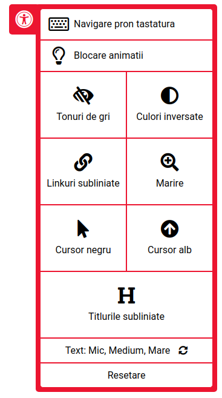

# Simple user helper library



## Installation

This library needed font awesome icons!!
https://fontawesome.com/

Using npm:
```shell
$ npm i -g npm
$ npm i --save userhelperlibrary
```

Using yarn: 
```shell
$ yarn add userhelperlibrary
```

In React:
```js
import React, {useEffect} from 'react';
import ReactDOM from 'react-dom';
import './index.css';
import userhelperlibrary from "userhelperlibrary";

const App = ()=> {
  useEffect(() => {
    userhelperlibrary();
  }, []);
  
    return(
      <div>
        // any code...
      </div>
    )
}

ReactDOM.render(<App />, document.getElementById('root'));
```
In Vue.js:
```js
<script>
 import userHelperLibrary from "userhelperlibrary";

  export default {
    name: "App",
    components: {},
    computed: {},
    methods: {},
    created() {
      userHelperLibrary();
    }
  };
</script>
```